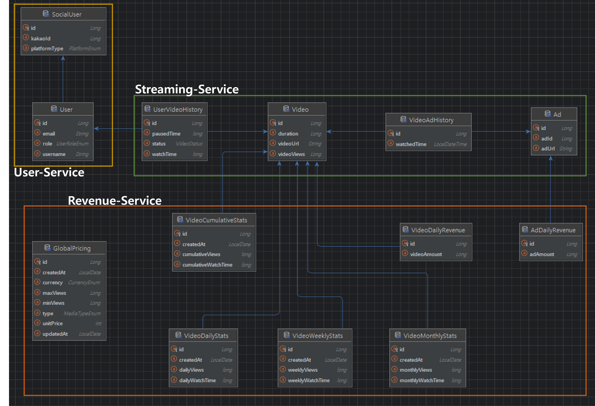
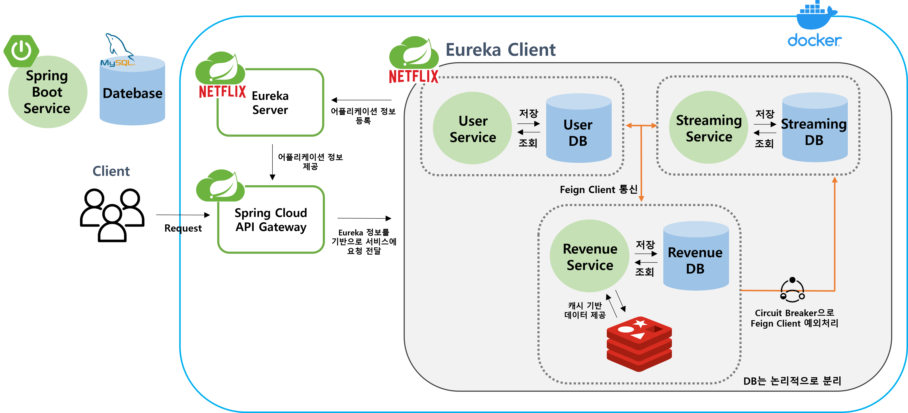

# PaySystem

## 🚀프로젝트 소개

이 프로젝트는 스트리밍 플랫폼에서 판매자를 위한 **통계 및 정산 관리 시스템**을 개발하기 위해 설계된 개인 프로젝트 입니다. 
판매자들이 콘텐츠 성과와 수익을 효율적으로 관리하고 분석할 수 있는 기능을 제공합니다.

초기에는 모놀리식(레이어드 아키텍처) 구조로 설계되었으나, **마이크로서비스 아키텍처(MSA)로 전환**하여 회원 관리, 스트리밍 관리, 정산 관리 서비스를 독립적으로 운영할 수 있도록 설계되었습니다.
이를 통해 각 서비스의 유연성과 확장성을 강화하고, 대규모 데이터를 안정적으로 처리할 수 있는 구조로 구현했습니다.

**개발 기간**

2024.10.16 ~ 2024.11.12 (4주)

## 💻 Docker-Compose 실행 명령어

```
docker-compose up -d
```

## 🗂 ERD




## 🛠기술스택
- Spring Boot, Spring Batch, Spring Security, Java, Gradle
- MySQL, JPA
- Redis
- Spring Cloud Gateway, Eureka, Resilience4J
- Docker-Compose, Github


## 🏗 MSA 구성도



### 주요 구성 요소
- **Spring Cloud Gateway** : API 요청마다 JWT 유효성을 검증하여 인증된 사용자만 서비스에 접근할 수 있도록 보안 레이어 구축. 중앙화된 인증 및 권한 관리를 지원
- **Eureka Server** : 오토 스케일링되는 인스턴스의 IP를 게이트웨이가 자동으로 인식하여 동적 라우팅과 로드 밸런싱을 지원할 수 있도록 등록 관리 시스템 구축
- **MySQL** : 각 서비스에 맞는 테이블을 논리적으로 분리하여 사용함으로써 확장성과 데이터 일관성을 유지
- **Redis** : 대량 데이터를 조회 시 Read-Aside 캐싱을 사용하여 조회 성능 극대화
- **Docker-Compose** : 모든 서비스를 컨테이너화해 독립적으로 실행 가능하며, 환경 간의 일관성 유지

### 각 서비스의 주요 역할 

#### 회원 서비스 (User Service)

- 소셜 및 JWT를 활용한 회원가입/로그인/로그아웃

#### 스트리밍 서비스 (Streaming Service)

- 등록된 동영상을 조회
- 동영상 재생 및 정지
- 광고 삽입

#### 정산 서비스 (Revenue Service)

- 일간, 주간, 월간 조회수 및 재생 시간의 Top5 조회
- 일간, 주간, 월간 정산 내역 조회

**배치 작업**
- 일일 콘텐츠 조회 수 및 재생 시간을 기반으로 한 통계 생성
- 일간, 주간, 월간 정산 데이터 집계

[API 명세서 자세히 보기](https://documenter.getpostman.com/view/19722199/2sAY55ad9r)

## 🌟프로젝트 주요 기능 및 Job 단위 Flow
### 주요 Job 단위 Flow


- 구조화된 데이터 처리를 통해 데이터 멱등성과 일관성을 보장하며, 장애 복구와 데이터 상태 추적에 용이하도록 배치 작업을 설계
- 순차적으로 실행되는 Job은 각 단계별로 데이터를 생성, 가공, 저장하며 최적화된 데이터 처리 파이프라인을 형성
- 통계 데이터 생성과 정산 데이터 집계를 수행하여 서비스의 신뢰성과 효율성을 극대화

### Job 기능 설명
- **VideoCumulative Job : 누적 통계 데이터 생성**
  - 스트리밍 서비스의 API를 호출하여 데이터를 가져와 누적 조회수와 재생 시간 데이터를 저장
- **VideoDailyStats Job : 일별 통계 생성**
  
  - 누적 데이터와 실시간 데이터를 계산하여 일별 통계를 저장
  - 배치 최적화를 수행하여 **데이터 처리 시간 90 m -> 6m으로 약 82% 단축**

- **VideoDailyRevenue Job : 일별 영상 정산 데이터 생성**
  
  - Step ExecutionContext에 저장된 정산 단가 금액표를 기반으로 영상 정산 데이터를 생성 및 저장
- **AdDailyRevenue Job : 일별 광고 정산 데이터 생성**

  - 광고 데이터와 정산 단가를 결합하여 일별 광고 수익 데이터 생성
  - 서버 부하 감소를 위한 서킷 브레이커(Resilience4J) 적용

위 배치 작업으로 생성된 데이터를 기반으로 통계 및 정산 조회 기능 수행, 추후 판매자와 내부팀이 해당 데이터를 사용하여 마케팅에 활용

## 🔥성능 최적화

### 1. Batch 작업 : Reader 최적화와 파티셔닝 도입
   [최적화 과정 자세히보기](https://ranny-devlog.tistory.com/entry/%EC%84%B1%EB%8A%A5-%EC%B5%9C%EC%A0%81%ED%99%94-300%EB%A7%8C-%EA%B1%B4%EC%9D%98-%EB%B0%B0%EC%B9%98-%EC%9E%91%EC%97%85%EC%9D%84-%EC%84%B1%EB%8A%A5-%EA%B0%9C%EC%84%A0%ED%95%B4%EB%B3%B4%EC%9E%90-8235-%EA%B0%9C%EC%84%A0)

| 단계 | 데이터 규모 | 처리시간 | 개선율          |
| --- | --- | --- |--------------|
| 최적화 전 | 300만 건 | 90분 + | -            |
| 1차 최적화 | 300만 건 | 34분 6초 | **↓ 62.22%** |
| 2차 최적화 | 300만 건 | 6분 29초 | **↓ 82.35%** |

- 1차 최적화 : 데이터베이스 인덱싱, 쿼리 최적화, Reader 리팩토링 (API 페이징 적용, 특정 Reader JDBC 직접 사용)
- 2차 최적화 : Spring Batch 파티셔닝 도입, Writer saveAll로 저장

<br>

### 2. 통계 조회 API : 다중 컬럼 인덱싱을 활용<br>
#### 성능 요약
- 약 300만 건의 데이터를 처리하는 쿼리의 실행 시간을 **7798 ms -> 1.474 ms**로 단축<br>
- 다중 컬럼 인덱스를 적용하여 정렬 단계를 제거하고 쿼리 성능을 최적화

#### [AS-IS]
- 기존 쿼리는 `created_at` 필드로 필터링한 뒤, 약 300만 행을 `daily_views` DESC로 정렬하여 상위 5개 데이터를 추출
- 정렬 단계에서 성능 병목이 발생하며 7,798ms가 소요

#### [TO-BE]
- `created_at` 와 `daily_views` 필드를 다중 컬럼 인덱스 설정
   - `created_at` : 필터링 조건으로 사용되는 필드로, 조건 기반 검색 최적화
   - `daily_views` : 정렬 기준으로 사용되는 필드로, 인덱스를 통해 정렬 과정 제거
   - 인덱스 적용 후 EXPLAIN ANALYZE 결과에서 정렬 단계 제거 확인

#### 부하 테스트 결과

| 단계      | 데이터 규모  | TPS            | 응답 시간        |
|---------|---------|----------------|--------------|
| 최적화 전   | 50만 건   | 0.77 /sec      | 12,827 ms    | 
| 최적화 후   | 50만 건   | 48.4 /sec      | 15 ms        | 
| **개선율** | -       | **↑ 6185.71%** | **↓ 99.88%** | 


<br>

### 3. 정산 조회 API : Redis 캐싱 활용
   - **조회 API 응답 속도 1371ms -> 392ms**

#### 부하 테스트 결과

| 단계      | 데이터 규모  | TPS            | 응답 시간        |
|---------|---------|----------------|--------------|
| 최적화 전   | 50만 건   | 2.3 /sec      | 27,813 ms    | 
| 최적화 후   | 50만 건   | 15.1 /sec      | 2,688 ms        | 
| **개선율** | -       | **↑ 556.52%** | **↓ 90.34%** | 

- Read-Aside 캐싱 전략을 적용
- Redis에 캐싱된 데이터가 있으면 DB 조회를 생략하고, 데이터를 가져올 수 있도록 최적화

## 💭 기술적 의사결정 및 트러블 슈팅

### 기술적 의사결정

- 레이어드 아키텍처 -> MSA(MicroService Architecture) 전환
  
(링크 추가 예정)

### 트러블 슈팅 경험
- [Redis에서 List\<Dto\> 역직렬화 문제 해결](https://ranny-devlog.tistory.com/entry/%ED%8A%B8%EB%9F%AC%EB%B8%94-%EC%8A%88%ED%8C%85-Redis%EC%97%90%EC%84%9C-ListDto-%EC%97%AD%EC%A7%81%EB%A0%AC%ED%99%94-%EB%AC%B8%EC%A0%9C-%ED%95%B4%EA%B2%B0-%EA%B3%BC%EC%A0%95)
   


